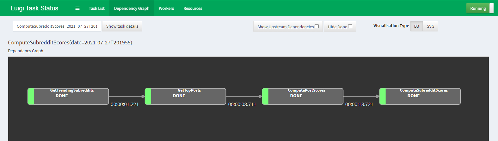

### Reddit Report - Coding Task

#### Steps -
1. Install the requirements.py using `pip install -r requirements.txt`
2. Create a `.env` file in the same folder level with the following contents
   - CLIENT_ID="XXXXXXX"
   - SECRET_KEY="XXXXXXXX"
   - User="username"
   - password=add password here 
3. Run the pipeline using the command `python -m luigi --module main ComputeSubredditScores --local-scheduler >>luigi_dev.log 2>&1`
This runs the pipeline in local scheduler mode.

#### Note - 

- Praw package was used to interact with the reddit api. Luigi package was used to create the pipeline.
- Reddit Api client ID and secret key are stored in **.env** file
- Logs are stored in luigi.log file
- The config parameters for each task in the pipeline are stored in luigi.cfg file. The **luigi_prod.cfg** file is for when we run in production environment.
- Input parameters can be changed in the config file.


#### Luigi Pipeline components in main.py -



- **GetTrendingSubreddits** - gets the list of N trending subreddits 
    Input - Takes N as input parameter. If N = 20, twenty trending subreddits are fetched
    Output - Outputs the trending subreddits in a txt file which will be used by next task to get Top posts from each subreddit

- **GetTopPosts** - gets the top N posts for a given subreddit
    Input - Takes N input which defines the number of posts to be fetched for each subreddit
    Output - Gives out topPosts.json file

- **ComputePostScores** - gets the comments for each post and calculates the Post scores as (sum of all comment scores) / N

    Input - Takes N which is the number of comments to be fetched for each post
    Output - PostScores.json which has the post score values of each post under a subreddit

- **ComputeSubredditScores** - Computes the subreddit score from post scores using the formula  sub_score = (sum of post_scores) / N , N = # of posts
    Input is PostScores.json file which is created from the prev step.
    Output is SubredditScores.txt file which has score for each subreddit


#### Bonus Points - 
1. How do you integrate your solution with central scheduler?

- Start the `luigid` server with the following command `luigid --background` to run in the background
- Launch the browser and go to `localhost:8082`
- Run the pipeline using `python -m luigi --module main ComputeSubredditScores`


2. How would you containerize the pipeline?
- We can use Docker to containerize the pipeline. We have to create a `Dockerfile` and can save the secret-key, username and password using Docker secrets

4. How can you automate deployment and testing of your solution?
- Using a service like Azure devops or Github Actions we can create a .yml file to automatically trigger the build-test-deploy workflow.

```
name: py
    
    on:
      schedule:
        - cron: "0 0 * * *" #runs at 00:00 UTC everyday
    
    jobs:
      build:
        runs-on: ubuntu-latest
    
        steps:
          - name: checkout repo content
            uses: actions/checkout@v2 # checkout the repository content to github runner.
          - name: setup python
            uses: actions/setup-python@v2
            with:
              python-version: 3.9 #install the python needed
          - name: install requirements
              python -m pip install --upgrade pip
              pip install -r requirements.txt
          - name: execute py script # run the run.py to get the latest data
            run: |
              python -m luigi --module main ComputeSubredditScores --local-scheduler
            env:
              key: ${{ secrets.key }} # if run.py requires passwords..etc, set it as secrets
          - name: export index
            .... # use crosponding script or actions to help export.

```